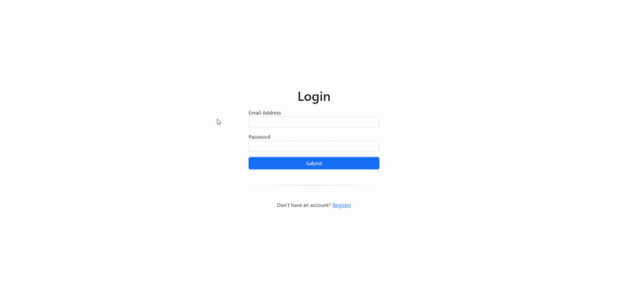

# Simple User Login (PHP)

> ⚠️ **This project is for practice and educational purposes only. Do not use in production.**

A simple PHP application demonstrating user authentication with registration, login, and logout functionality. Passwords are securely hashed and stored in a database. The project uses Bootstrap for a clean, responsive UI.

## Features

- User registration and login
- Secure password hashing (using PHP's `password_hash`)
- Session-based authentication
- Logout functionality
- Responsive Bootstrap UI

## Getting Started

1. **Clone or download** this repository.
2. Import the provided SQL file (`db/database.sql`) into your MySQL database.
3. Update database credentials in `includes/connection.inc.php` as needed.
4. Run the project using XAMPP or another local PHP server.

## Example

## Disclaimer

This project is a basic demonstration and **lacks advanced security features** required for production use (such as CSRF protection, input validation, and rate limiting). Use at your own risk.